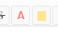
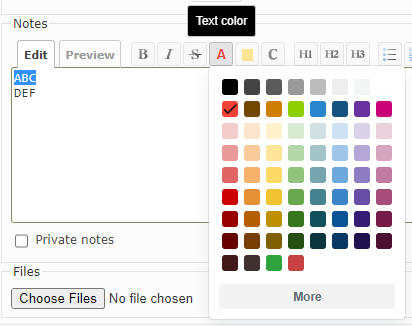
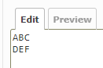
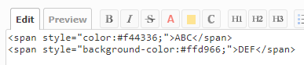
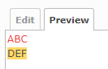

# Redmine wiki text colorizer

This is the plugin for Redmine.  
This plugin adds two buttons to jsToolBar  to apply HTML tags for text color and
background color.  


## Installation
### When using git
1. Clone this repository to your Redmine plugins directory.
    ```
    git clone https://github.com/sk-ys/redmine_wiki_text_colorizer.git YOUR_REDMINE_DIRECTORY/plugins/    redmine_wiki_text_colorizer
    ```
2. Restart Redmine.

### When not using git
1. Download zip file ( [redmine_wiki_text_colorizer-main.zip](https://github.com/sk-ys/redmine_wiki_text_colorizer/archive/refs/heads/main.zip) ).
2. Extract the ZIP file to your Redmine plugin directory. The name of the unzipped directory must be `redmine_wiki_text_colorizer`.
3. Restart Redmine.


## Usage
1. Select text to format  


2. By opening the color palette and selecting a color, HTML tags will be
inserted ( Images-2 ).  


### Images
1. Sample text before editing  


2. Sample text after editing  
  
 ( Background color has been applied as well as text color. )

3. Preview of sample text after editing  



## ⚠️Caution
If you are using `Textile` or `Markdown` text formatting in Redmine, you will
need to manually update the Redmine source code to support html `SPAN` tag in 
the wiki.  
`CommonMark Markdown` does not require updating the Redmine source code.

## Libraries in use
### Spectrum v2.0.10
This plugin utilizes the Spectrum library (https://github.com/seballot/spectrum)
for color picker functionality. Thanks.
