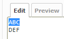

# Redmine wiki text colorizer

This is the plugin for Redmine.  
This plugin adds two buttons to jsToolBar to output HTML tags for changing the 
text color and background color. 


## Installation
### When using git
1. Clone this repository to your Redmine plugins directory.
    ```
    git clone https://github.com/sk-ys/redmine_wiki_text_colorizer.git YOUR_REDMINE_DIRECTORY/plugins/redmine_wiki_text_colorizer
    ```
2. Restart Redmine.

### When not using git
1. Download zip file from the [release page](https://github.com/sk-ys/redmine_wiki_text_colorizer/releases) or the [latest main repository](https://github.com/sk-ys/redmine_wiki_text_colorizer/archive/refs/heads/main.zip). 
2. Extract the ZIP file to your Redmine plugin directory. The name of the unzipped directory must be `redmine_wiki_text_colorizer`.
3. Restart Redmine.


## Usage
1. Select the text you want to format.  


2. Open the color palette and select a color. This will insert an HTML tag.  


### Images
1. Sample text before formatting  


2. Sample text after formatting  
  
 ( Background color has been applied as well as text color. )

3. Preview of sample text after formatting  


## Text formatting information
This information provides an overview of the text formatting styles supported by Redmine, and highlights specific test cases to demonstrate how different formats behave in various scenarios (unofficial).  
This plugin supports both `HTML format without double quotes` and `Textile CSS format`.

### Example
#### HTML format without double quotes
```
<span style=color:red;>HTML format without double quotes</span>
```
#### Textile CSS format
```
%{color:red}Textile format%
```
(To use this option, you need to check the `Use Textile CSS output` checkbox must be checked in plugin settings page and Redmine must be configured to use the Textile format.)

### Test cases
```
* %{color:red}Textile format%
* %{background-color:yellow}Textile format%
* %{color:red;background-color:yellow}Textile format with multiple styles%
* %{color:red}%{background-color:yellow}Nested Textile format%% 
* <span style=color:red;>HTML format without double quotes</span>
* <span style=background-color:yellow;>HTML format without double quotes</span>
* <span style=color:red;background-color:yellow;>HTML format with multiple styles without double quotes</span>
* <span style=color:red;><span style=background-color:yellow;>Nested HTML format without double quotes</span></span>
* <span style="color:red;">HTML format with double quotes</span>
* <span style="background-color:yellow;">HTML format with double quotes</span>
* <span style="color:red;background-color:yellow;">HTML format with multiple styles with double quotes</span>
* <span style="color:red;"><span style="background-color:yellow;">Nested HTML format with double quotes</span></span>
```

### Summary
| Format                                                 | Textile | Markdown(Deprecated) | CommonMark Markdown (GitHub Flavored) |
|--------------------------------------------------------|:-------:|:--------------------:|:-------------------------------------:|
| Textile format                                         | ✔      | ✖                   | ✖                                    |
| Textile format with multiple styles                    | ✔      | ✖                   | ✖                                    |
| Nested Textile format[^1]                              | ✖      | ✖                   | ✖                                    |
| HTML format without double quotes                      | ✔ [^2] | ✔ [^3]              | ✔                                    |
| HTML format with multiple styles without double quotes | ✔ [^2] | ✔ [^3]              | ✔                                    |
| Nested HTML format without double quotes               | ✔ [^2] | ✔ [^3]              | ✔                                    |
| HTML format with double quotes                         | ✖      | ✔ [^3]              | ✔                                    |
| HTML format with multiple styles with double quotes    | ✖      | ✔ [^3]              | ✔                                    |
| Nested HTML format with double quotes                  | ✖      | ✔ [^3]              | ✔                                    |

[^1]: When applying both text color and background color to a string using Textile formatting, manual code modification is required.  
Example: `%{color:red}%{background-color:yellow}text%%` -> `%{color:red;background-color:yellow}text%`

[^2]: Redmine source code must be manually updated.  
Change the following: `ALLOWED_TAGS = %w(pre code kbd notextile)` -> `ALLOWED_TAGS = %w(pre code kbd notextile span)`  
For details, refer to [this link](https://www.redmine.org/projects/redmine/repository/svn/entry/branches/5.1-stable/lib/redmine/wiki_formatting/textile/redcloth3.rb?utf8=%E2%9C%93&rev=22755#L1211).

[^3]: Redmine source code must be manually updated, but this involves security risks, so I recommend using CommonMark Markdown (GitHub Flavored) text formatting.  
Change the following: `:filter_html => true,` -> `:filter_html => false,`  
For details, refer to [this link](https://www.redmine.org/projects/redmine/repository/svn/revisions/22755/entry/branches/5.1-stable/lib/redmine/wiki_formatting/markdown/formatter.rb#L91).

## Libraries in use
### Spectrum v2.0.10
This plugin utilizes the Spectrum library (https://github.com/seballot/spectrum)
for color picker functionality. Thanks.
